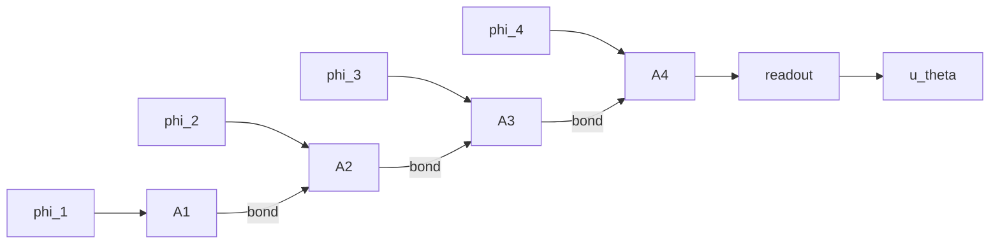
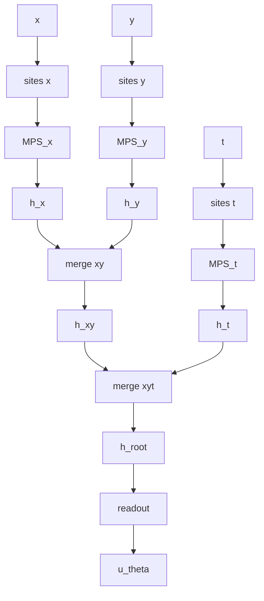
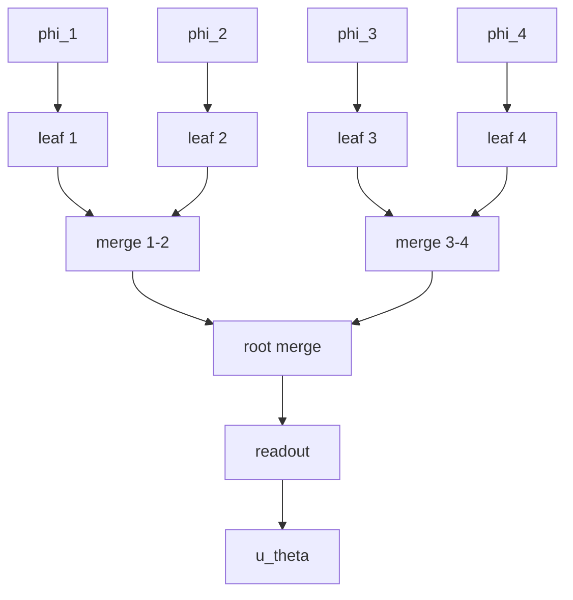
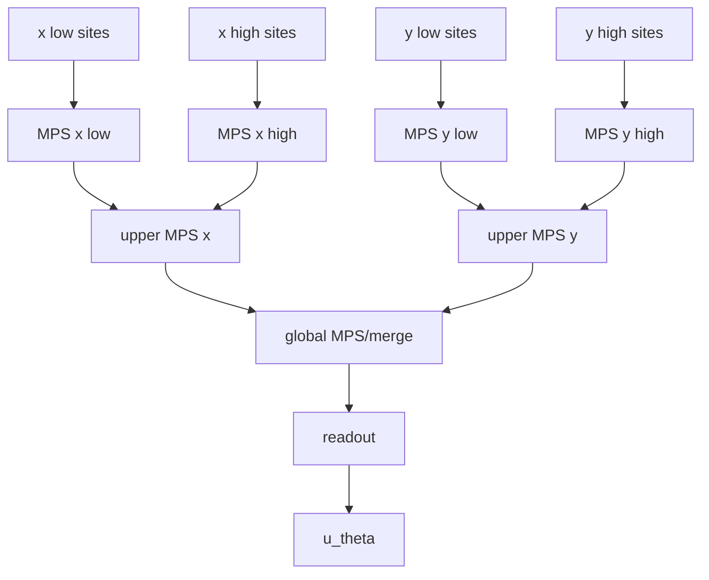

# 02. Tensor network architectures

## Shapes comunes

Entrada física:

```text
coords: [B, p]
```

Feature map:

```text
features: [B, S, d]
```

o por coordenada:

```text
features_by_coord["x"]: [B, S_x, d]
features_by_coord["y"]: [B, S_y, d]
features_by_coord["t"]: [B, S_t, d]
```

Salida:

```text
u: [B, q]
```

## Arquitectura 1: global MPS

Todos los sites se ordenan en una cadena.



Modelo:

$$
u_\theta^\alpha(z)
=
\sum_{i_1,\dots,i_S}
\sum_{r_1,\dots,r_{S-1}}
A_1^{i_1,r_1}
A_2^{r_1,i_2,r_2}
\cdots
A_S^{r_{S-1},i_S,r_S}
R^{r_S,\alpha}
\prod_{s=1}^S
\phi_s^{i_s}(z)
$$

Parámetros aproximados:

$$
O(S d \chi^2 + \chi q)
$$

Uso:

- baseline tensorial simple;
- útil para comprobar que feature maps y derivadas funcionan.

## Arquitectura 2: coordinate_branch_mps

Una rama MPS por coordenada física.



Rama por coordenada:

$$
h_x(x)
=
\operatorname{MPS}_x
\left(
\phi_{x,1}(x),
\dots,
\phi_{x,S_x}(x)
\right)
$$

Merge binario:

$$
h_{ab}^{c}
=
\sum_{i,j}
M^{i,j,c}
h_a^i
h_b^j
$$

Readout:

$$
u^\alpha
=
\sum_r
R^{r,\alpha}
h_{\mathrm{root}}^r
$$

Ventajas:

- interpretable;
- natural para PDEs separadas por coordenadas;
- permite controlar sites por coordenada.

## Arquitectura 3: binary_ttn

Árbol binario sobre todos los sites.



Leaf:

$$
v_s^a(z)
=
\sum_i
L_s^{i,a}
\phi_s^i(z)
$$

Merge:

$$
v_p^c(z)
=
\sum_{a,b}
M_p^{a,b,c}
v_l^a(z)
v_r^b(z)
$$

Readout:

$$
u^\alpha(z)=\sum_c R^{c,\alpha}v_{\mathrm{root}}^c(z)
$$

Ventajas:

- jerarquía explícita;
- fácil analizar rangos por cortes del árbol;
- natural para agrupaciones multiescala.

## Arquitectura 4: branched_mps

Arquitectura de MPS locales que se ramifican en MPS superiores.



Uso:

- probar la hipótesis de que features por escala pueden fusionarse jerárquicamente;
- más cercana a “MPS que se ramifican en otros MPS”.

## Control de bond dimension

Cada arquitectura debe aceptar:

```yaml
model:
  tensor_network:
    bond_dim: 8
```

Opcionalmente, permitir bond dimensions por zona:

```yaml
model:
  tensor_network:
    bond_dims:
      branch: 8
      merge: 8
      root: 16
```

## Backend TensorKrowch

La implementación principal debe crear nodos parametrizables manuales.

El diseño interno recomendado:

```text
TensorNetworkModel(torch.nn.Module)
├── feature_map
├── backend
│   ├── build_graph()
│   ├── set_input_features(features)
│   ├── contract()
│   └── diagnostics()
└── forward(coords)
```

`forward(coords)` debe:

1. calcular sites;
2. crear o actualizar nodos de entrada;
3. contraer la red;
4. devolver `[B, q]`.

## Backend de referencia

Debe existir un backend alternativo `torch_einsum_reference` para tests de forma y depuración. Puede usar `torch.einsum` directamente.

No debe ser el backend por defecto.
